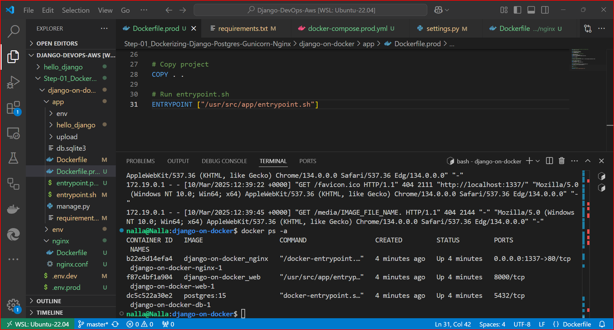

# Hello Django

This is a simple Django application that is set up to run within Docker containers. It includes PostgreSQL as the database and has an example of file uploading functionality.

## Prerequisites

- Docker
- Docker Compose

# Django Application Deployment with Docker

## Overview
This guide outlines the steps followed to deploy a Django application using Docker, Docker Compose, PostgreSQL, Gunicorn, and Nginx. The setup ensures that the application is containerized and can be easily managed and scaled in a production environment.

## Project Structure

```
django-on-docker
├── app
│   ├── Dockerfile
│   ├── Dockerfile.prod
│   ├── entrypoint.sh
│   ├── entrypoint.prod.sh
│   ├── requirements.txt
│   ├── hello_django
│   │   ├── __init__.py
│   │   ├── settings.py
│   │   ├── urls.py
│   │   ├── wsgi.py
│   │   └── ...
│   ├── manage.py
│   └── .gitignore
├── nginx
│   ├── Dockerfile
│   └── nginx.conf
├── docker-compose.yml
├── docker-compose.prod.yml
├── .env.prod.sh
└── .env.prod.db.sh
├── .env.dev.sh

```

## Steps followed to Deploy Django Application with Docker

### 1. Create Dockerfile for Development
- Created a `Dockerfile` for the development environment inside the `app` directory.
- Configured the Dockerfile to set up the Python environment, install dependencies, and run the Django development server.

### 2. Create Entrypoint Script for Development
- Created `entrypoint.sh` script to handle tasks such as applying database migrations and starting the Django development server.
- Made the script executable.

### 3. Create Docker Compose File for Development
- Created `docker-compose.yml` to define services for the Django application, PostgreSQL database, and other dependencies.
- Configured volume mounts, environment variables, and service dependencies.

### 4. Test Django Application in Development
- Built and started the Docker containers using the development configuration.
- Verified that the Django application was running correctly.

### 5. Create Dockerfile for Production
- Created `Dockerfile.prod` for the production environment inside the `app` directory.
- Configured the Dockerfile to set up the Python environment, install dependencies, and run Gunicorn.

### 6. Create Entrypoint Script for Production
- Created `entrypoint.prod.sh` script to handle tasks such as waiting for the PostgreSQL database, applying database migrations, collecting static files, and starting Gunicorn.
- Made the script executable.

### 7. Create Nginx Configuration
- Created `nginx.conf` to configure Nginx to proxy requests to the Gunicorn server and serve static and media files.

### 8. Create Dockerfile for Nginx
- Created a `Dockerfile` for Nginx inside the `nginx` directory.
- Configured the Dockerfile to use the official Nginx image and copy the custom Nginx configuration.

### 9. Create Docker Compose File for Production
- Created `docker-compose.prod.yml` to define services for the Django application, PostgreSQL database, and Nginx server.
- Configured volume mounts, environment variables, and service dependencies.

### 10. Build and Start Production Containers
- Built and started the Docker containers using the production configuration.
- Verified that the Django application was running correctly behind Nginx.

### 11. Verify Application
- Accessed the application in the browser to verify that it was running correctly.
- Checked logs and configurations to troubleshoot any issues encountered.


By following these steps, we can successfully deploy our Django application using Docker, Docker Compose, PostgreSQL, Gunicorn, and Nginx. This setup ensures that your application is containerized and can be easily managed and scaled in a production environment.

## Commands Used in Step 1

- **Build and start development containers:**
  ```bash
  docker-compose up -d --build
  ```

- **Check status of running containers:**
  ```bash
  docker ps
  ```

- **Stop and remove containers:**
  ```bash
  docker-compose down
  ```

- **Build and start production containers:**
  ```bash
  docker-compose -f docker-compose.prod.yml up -d --build
  ```

- **Check logs for specific containers:**
  ```bash
  docker logs <container-id>
  ```

- **Rebuild specific service:**
  ```bash
  docker-compose up -d --build <service-name>
  ```

- **Access a running container's shell:**
  ```bash
  docker exec -it <container-id> /bin/bash
  ```

## Images
Here are some images related to the deployment process:

.
.
.
.


## Steps for Next Implementation

### Step 2: Storing Static & Media Files on AWS S3
- Configure Django to store static and media files on AWS S3.
- Update Django settings to use `django-storages` and `boto3` for S3 integration.
- Set up AWS S3 buckets for static and media files.
- Ensure that the application can correctly upload and serve files from AWS S3.