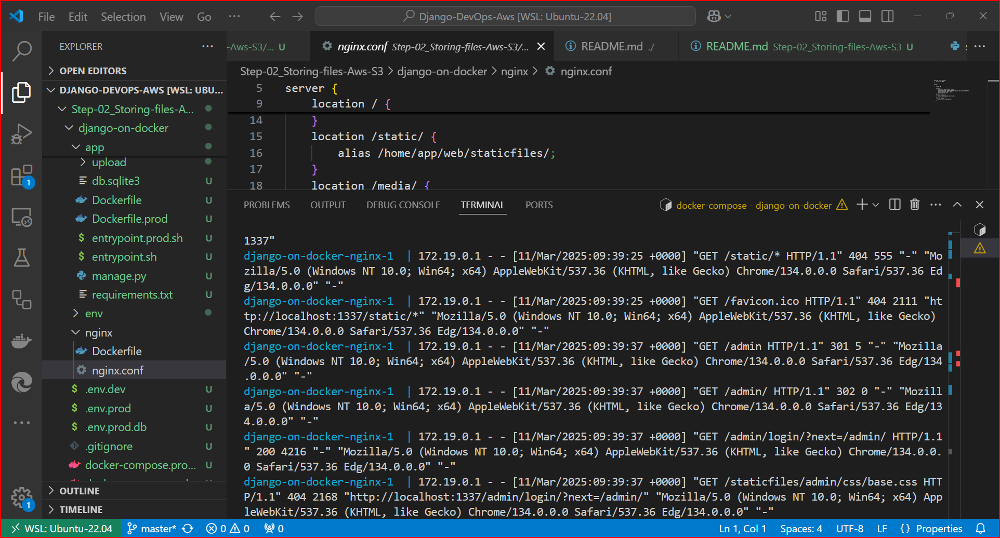
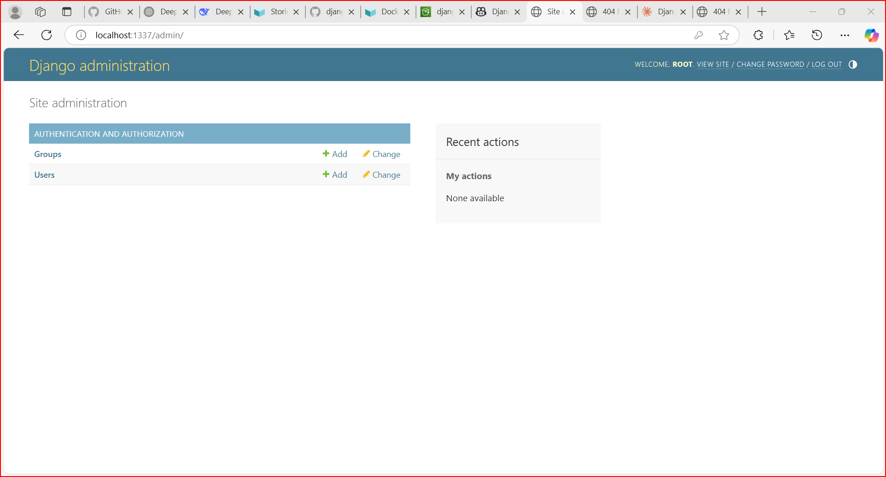
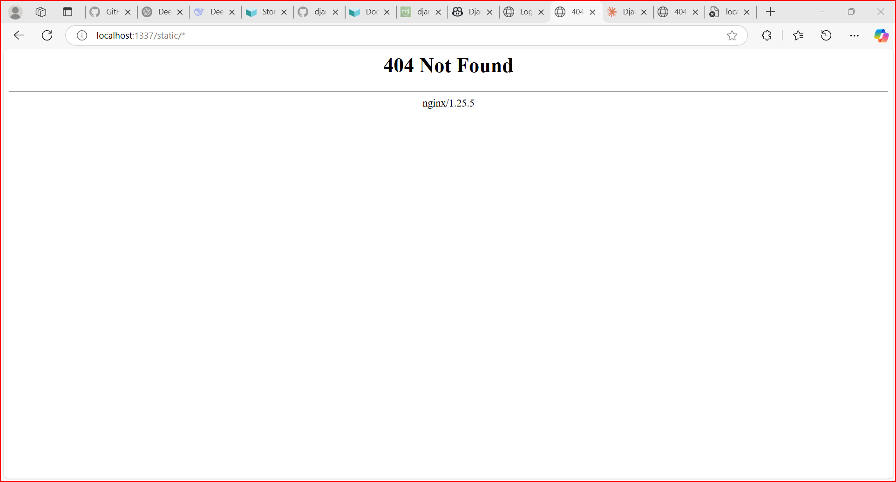
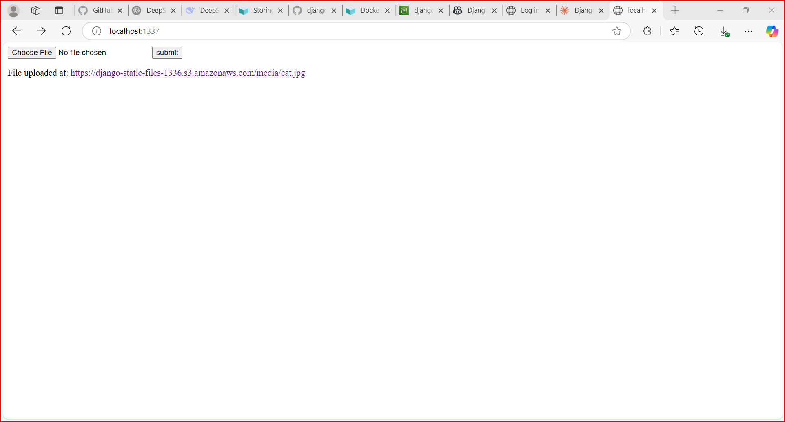
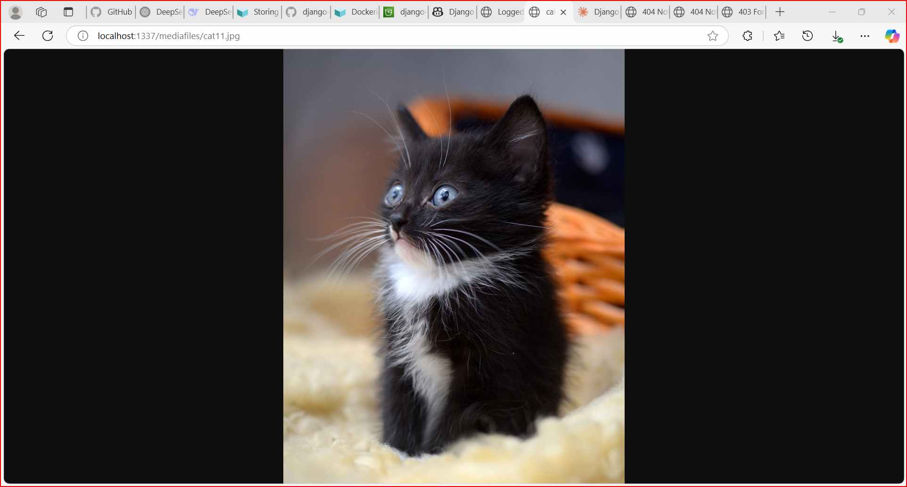
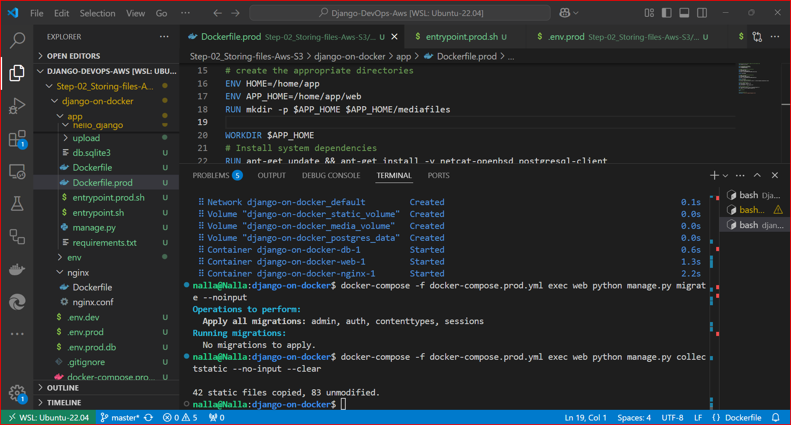
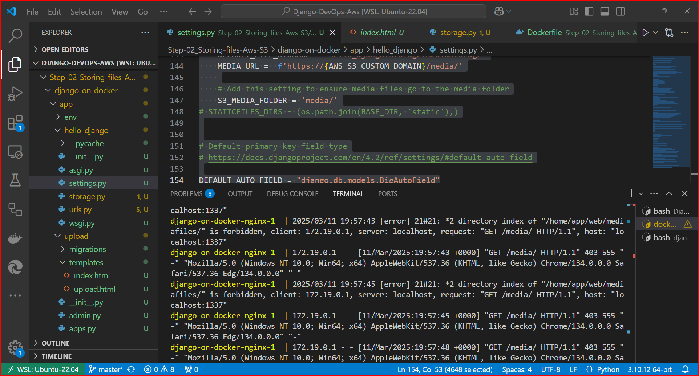
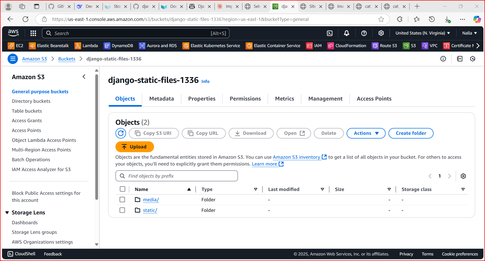

# Dockerizing Django with PostgreSQL, Gunicorn, Nginx, and Amazon S3
## Step-02: Storing Django Static and Media Files on Amazon S3

### Overview

This step involves configuring Django to store static and media files on **Amazon S3**, ensuring scalability and performance for your application.  
## Prerequisites

- Docker and Docker Compose installed
- AWS account
- Basic knowledge of Django and AWS services

## Project Structure

- `Dockerfile`: Base Dockerfile for the Django application
- `Dockerfile.dev`: Dockerfile for development environment
- `Dockerfile.prod`: Dockerfile for production environment
- `docker-compose.yml`: Default Docker Compose file
- `docker-compose.dev.yml`: Docker Compose configuration for development
- `docker-compose.prod.yml`: Docker Compose configuration for production
- `nginx/`: Directory containing NGINX configuration for production
- `.env.dev`: Environment variables for development
- `.env.prod`: Environment variables for production

### 1. Create an S3 Bucket

1. Log in to your **AWS Console** and navigate to the **S3 service**.
2. Click **Create bucket** and provide a unique bucket name.
3. Choose the **AWS region** closest to your users for better performance.
4. Configure bucket settings:
   - Disable **Block all public access** if you want public access to static/media files.
   - Enable **Bucket Versioning** (optional) for tracking file changes.
5. Click **Create bucket** to finalize.

### 2. Create an IAM User for S3 Access

1. Go to the **IAM (Identity and Access Management) Console**.
2. Click **Users → Add User**, provide a name, and enable **Programmatic Access**.
3. Attach necessary permissions to allow Django to read and write files in the S3 bucket.
4. Once the user is created, **save the Access Key ID and Secret Access Key**, as they will be used in the Django settings.

### 3. Install Required Dependencies in Django

Update your Django project to use **boto3** (AWS SDK for Python) and **django-storages**:

```sh
pip install boto3 django-storages
```

Ensure these packages are added to your `requirements.txt` (if using one):

```nginx
boto3
django-storages
```

### 4. Configure Django to Use S3 for Static & Media Files

Open your Django project's `settings.py` and add the following configurations:

1. Set `django-storages` as the default storage backend.
2. Add AWS credentials and S3 bucket settings.

Modify `settings.py`:

```python
import os

# Install storages backend
INSTALLED_APPS += ["storages"]

# AWS Credentials (Use environment variables for security)
AWS_ACCESS_KEY_ID = os.getenv("AWS_ACCESS_KEY_ID")
AWS_SECRET_ACCESS_KEY = os.getenv("AWS_SECRET_ACCESS_KEY")
AWS_STORAGE_BUCKET_NAME = "your-bucket-name"
AWS_S3_REGION_NAME = "your-region"

# Static files (CSS, JS, Images)
STATICFILES_STORAGE = "storages.backends.s3boto3.S3Boto3Storage"
STATIC_URL = f"https://{AWS_STORAGE_BUCKET_NAME}.s3.amazonaws.com/static/"

# Media files (Uploaded content)
DEFAULT_FILE_STORAGE = "storages.backends.s3boto3.S3Boto3Storage"
MEDIA_URL = f"https://{AWS_STORAGE_BUCKET_NAME}.s3.amazonaws.com/media/"
```

### 5. Store AWS Credentials Securely

Instead of hardcoding credentials in `settings.py`, store them in `.env` files or export them as environment variables:

```sh
export AWS_ACCESS_KEY_ID="your-access-key-id"
export AWS_SECRET_ACCESS_KEY="your-secret-access-key"
```

### 6. Run Migrations and Collect Static Files

After updating settings, run the following commands to apply changes:

```sh
python manage.py migrate
python manage.py collectstatic --noinput
```

This will upload all static files to the S3 bucket automatically.

### 7. Verify the Setup

- Check your S3 bucket to see if static and media files have been uploaded.
- Run your application and inspect the file URLs to confirm they are being served from Amazon S3.
- If using Docker, ensure that environment variables are correctly set inside your container.

### 8. Update NGINX Configuration (For Production Setup)

If running Django behind NGINX, update its configuration to properly serve media files via S3 instead of local storage. Restart NGINX and Gunicorn after making changes.

---

## Docker Compose Commands

### Build and Start Containers
```bash
docker-compose build
docker-compose up -d
```

### Stop and Restart Containers
```bash
docker-compose down
docker-compose restart
```

### View Logs
```bash
docker-compose logs
# Logs for a specific container
docker-compose logs web
```

### Execute Commands Inside Containers
```bash
docker-compose exec web bash
# Run Django management commands
docker-compose exec web python manage.py <command>
```

### Collect Static Files
```bash
docker-compose exec web python manage.py collectstatic --noinput
```

### Check Container Status
```bash
docker-compose ps
```

### Remove Containers, Networks, Volumes, and Images
```bash
docker-compose down --volumes --rmi all
docker system prune -a
```

## Development Environment Commands

### Build and Start Development Containers
```bash
docker-compose -f docker-compose.dev.yml build
docker-compose -f docker-compose.dev.yml up -d
```

### Stop and Restart Development Containers
```bash
docker-compose -f docker-compose.dev.yml down
docker-compose -f docker-compose.dev.yml restart
```

### View Development Logs
```bash
docker-compose -f docker-compose.dev.yml logs
# Logs for a specific container
docker-compose -f docker-compose.dev.yml logs web
```

### Execute Commands Inside Development Containers
```bash
docker-compose -f docker-compose.dev.yml exec web bash
# Run Django management commands
docker-compose -f docker-compose.dev.yml exec web python manage.py <command>
```

### Database and Static Files Management
```bash
docker-compose -f docker-compose.dev.yml exec web python manage.py createsuperuser
docker-compose -f docker-compose.dev.yml exec web python manage.py makemigrations
docker-compose -f docker-compose.dev.yml exec web python manage.py migrate
docker-compose -f docker-compose.dev.yml exec web python manage.py collectstatic --noinput
```

### Check Development Container Status
```bash
docker-compose -f docker-compose.dev.yml ps
```

## Production Environment Commands

### Build and Start Production Containers
```bash
docker-compose -f docker-compose.prod.yml build
docker-compose -f docker-compose.prod.yml up -d
```

### Stop and Restart Production Containers
```bash
docker-compose -f docker-compose.prod.yml down
docker-compose -f docker-compose.prod.yml restart
```

### View Production Logs
```bash
docker-compose -f docker-compose.prod.yml logs
# Logs for a specific container
docker-compose -f docker-compose.prod.yml logs web
```

### Execute Commands Inside Production Containers
```bash
docker-compose -f docker-compose.prod.yml exec web bash
# Run Django management commands
docker-compose -f docker-compose.prod.yml exec web python manage.py <command>
```

### Database and Static Files Management in Production
```bash
docker-compose -f docker-compose.prod.yml exec web python manage.py createsuperuser
docker-compose -f docker-compose.prod.yml exec web python manage.py makemigrations
docker-compose -f docker-compose.prod.yml exec web python manage.py migrate
docker-compose -f docker-compose.prod.yml exec web python manage.py collectstatic --noinput
```

### Check Production Container Status
```bash
docker-compose -f docker-compose.prod.yml ps
```

### Remove Production Containers, Networks, Volumes, and Images
```bash
docker-compose -f docker-compose.prod.yml down --volumes --rmi all
```

### Prune Unused Docker Images and Containers
```bash
docker system prune -a
```

## Images

Here are some images related to the deployment process:










---

By following these steps, you will have successfully set up your Django application with Docker, PostgreSQL, Gunicorn, Nginx, and Amazon S3 for static and media file storage.

## Continuation Step-03

In the next step, we will deploy the application to AWS ECS using Terraform. This will involve writing Terraform scripts to define ECS, ECR, and other AWS resources, and deploying the infrastructure using Terraform. The purpose is to automate the deployment process and ensure consistency across environments.